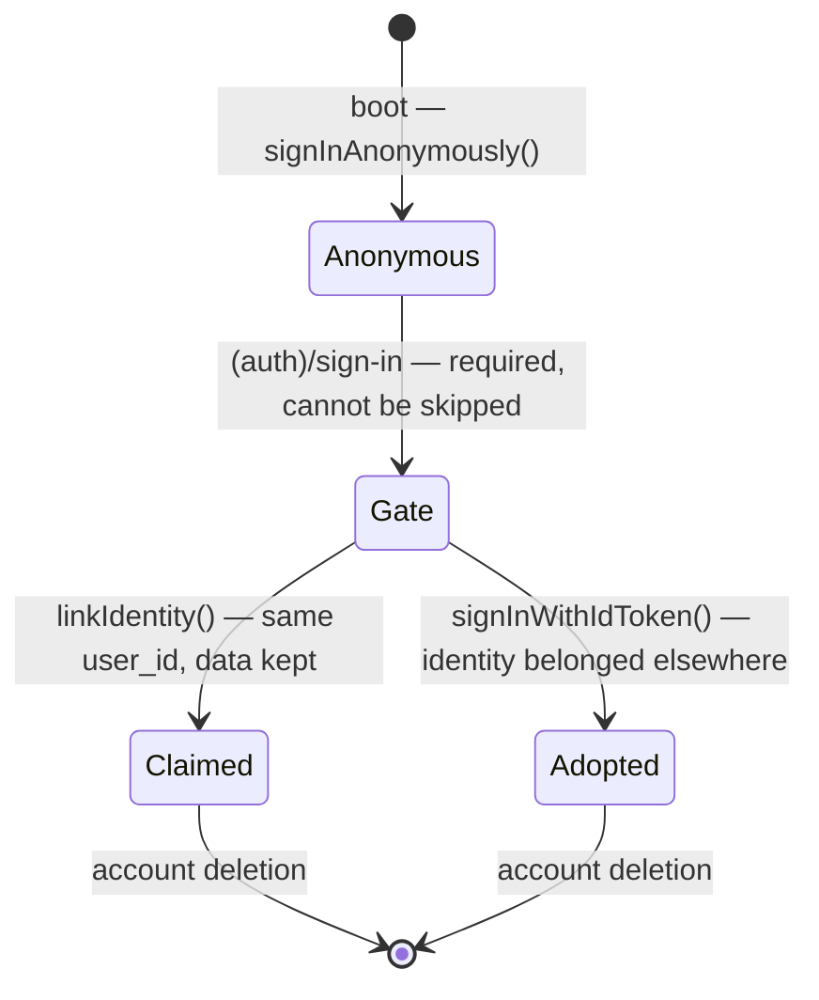

# 03 — AUTH ARCHITECTURE

_Supabase Auth. Sign-in is required before the app can be used (founder decision, 2026-07-24). Anonymous sessions still exist underneath as the substrate the chosen identity is linked to._

> **Reversal, 2026-07-24.** This document previously specified anonymous-first with **no auth screen before the wow**, and product doc 07's "no email asked at onboarding" rule followed from it. The founder has reversed that: sign-in or sign-up is now the first screen in the app. §1, §2.1 and §2.2 below are rewritten to match the code; the anonymous-first rationale is preserved in §2.4 because the mechanism it describes is still what runs underneath, and because the trade-off it names is real and was accepted knowingly.
>
> Product doc 07's friction rule is now **stale** and should be re-read in light of this.

---

## 1. Principles

1. **An identity before any content.** Nothing she writes is reachable until an account exists to own it. The sign-in gate is the first route the boot gate resolves, ahead of onboarding, the letter and the paywall.
2. **An account exists from second one.** Anonymous Supabase sessions are real users: real `user_id`, real rows, real RLS. The gate does not replace that — it **links** a credential to it, so the id never changes.
3. **Email + password is the front door** (founder decision, 2026-07-25), with Google, Apple and the emailed link alongside it. This REVERSES the "no passwords" rule this doc shipped with: the link round-trip through an inbox cost more sign-ups than the rule saved. The security cost is stated plainly in §6 rather than hidden.
4. **Purchase forces durability.** Money must never be attached to an unrecoverable identity. Now trivially satisfied: everyone is durable before they can spend.

## 2. Lifecycle

### 2.1 First launch

- App boot → no stored session → `supabase.auth.signInAnonymously()`.
- DB trigger creates `profiles` row; `is_anonymous = true`.
- Session persisted in secure storage (Keychain via expo-secure-store adapter for the Supabase client).
- PostHog identified with `user_id` (pseudonymous — 13 §2).
- **The boot gate then routes to `(auth)/sign-in` and stays there** until an identity is attached. The anonymous session is plumbing she never sees.

### 2.2 The gate (`app/(auth)/sign-in.tsx`)

Offers, in order: **Google** (Android's half), **Apple** (iOS's half, and required by App Store review when any third-party login is offered), then **Create account** and **Sign in** — email + password, the primary path since 2026-07-25 and the only one that works on a build with no provider configured.

The password form has two modes and one rule between them, which is the same claim-vs-adopt split `authenticateWithProvider` follows (`features/auth/password.ts`):

1. **Create account → `updateUser({ email, password })`**, converting the anonymous user in place. `user_id` does not change, so a part-way conversation survives. `signUp` is deliberately NOT used here: it mints a new user and orphans the draft behind a new session.
2. **Sign in → `signInWithPassword`**, which adopts an existing account and therefore wipes local device state (§5 step 5), exactly as the Apple path does.

A sign-up that comes back "already registered" moves her to the Sign in mode rather than failing — she is on the wrong tab, not in trouble. There is **no password-reset form**: "forgot your password" sends the magic link, which already exists and is already trusted.

`features/auth/session.ts#authenticateWithProvider` decides what a chosen identity means, and the order is load-bearing:

1. **`linkIdentity({ provider, token })` first.** Attaches the identity to the anonymous user this device is already on. `user_id` does not change, so memory, letter and the RevenueCat entitlement keyed to it (§4) all survive. This is the path for a brand-new user **and** for anyone who was part-way through the conversation before the gate existed.
2. **Only if that fails with `identity_already_exists`**, fall back to `signInWithIdToken` — the identity belongs to another account, which is the returning-on-a-new-phone case (§2.3). The local device state belonging to the abandoned anonymous user is wiped (§5 step 5).

Leading with `signInWithIdToken` would strand a part-way conversation every single time, silently. The match on the link failure is deliberately narrow: a network blip must not be read as "already taken".

Buttons are hidden, never drawn dead, when a provider is unavailable — Apple on Android, Google on a build with no client id.

The **restore sheet** (`features/auth/SignInSheet.tsx`, opened from Settings for an existing account) offers the same set — Google, Apple, then email — through the identical `authenticateWithProvider` path, so a returning Android user has a provider option there too, not only email. **Signing out** (`lib/accountReset.ts#signOutAndWipeDevice`) now also calls `googleSignOut()`: `supabase.auth.signOut` ends the Supabase session but the native Google SDK keeps its own account cached, and without this the next person on the device is silently re-offered — or auto-signed back into — the previous Google account.

**Enabling Google (Android) is three config facts, no code:**

1. `EXPO_PUBLIC_GOOGLE_WEB_CLIENT_ID` — the **Web** OAuth client id (not the Android one); this is the audience Supabase verifies the id-token against, and `googleAuthAvailable()` gates the button on it.
2. `GOOGLE_SERVICES_JSON` — path to `google-services.json`. `app.config.ts` adds the `@react-native-google-signin/google-signin` config plugin **only when this is set** (the plugin pulls in a Gradle plugin that fails the build outright with no file present), and it needs a **native rebuild** to take effect.
3. Supabase dashboard → Auth → Providers → **Google enabled**, with that Web client id listed under Authorized Client IDs. The Android OAuth client in Google Cloud must carry the signing key's **SHA-1** (the _debug_ keystore's for a debug-signed dev client).

### 2.3 Edge cases (the ones that bite)

| Case                                                                       | Handling                                                                                                                                                                                                                                                                                                                                                                    |
| -------------------------------------------------------------------------- | --------------------------------------------------------------------------------------------------------------------------------------------------------------------------------------------------------------------------------------------------------------------------------------------------------------------------------------------------------------------------- |
| **Purchase completes but claim abandoned** (user kills app on Apple sheet) | Purchase is already bound to RevenueCat `app_user_id` = Supabase `user_id`. On next launch, claim sheet re-presents (blocking banner on Home, dismissible once per session). Entitlement works meanwhile — never hold paid features hostage to claiming.                                                                                                                    |
| **Restore on a new device, never claimed**                                 | **No longer reachable** since the gate landed — nobody can create content without an identity. Retained for accounts predating 2026-07-24: old anonymous identity is unrecoverable, RevenueCat `restorePurchases()` transfers entitlement to the _new_ `app_user_id`, new profile starts empty, onboarding runs again. Honest copy: entitlement restored, content can't be. |
| **Restore on new device, previously claimed**                              | The normal path now. The gate's `linkIdentity` fails with `identity_already_exists` → falls back to `signInWithIdToken` → same `user_id` → data AND entitlement present. The fresh anonymous user the install created is abandoned empty, and local state is wiped (§5 step 5) so the previous device's cache cannot bleed through.                                         |
| **Existing part-way user meets the gate for the first time**               | Signs in → `linkIdentity` succeeds (that identity is not yet spoken for) → same `user_id`, draft and answers intact. This is why link-before-sign-in is not interchangeable.                                                                                                                                                                                                |
| **Apple credential revoked** (Settings → Apple ID)                         | Supabase identity remains; email identity (if linked) still works; else user can re-link on next sign-in prompt.                                                                                                                                                                                                                                                            |
| **Two devices, same claimed account**                                      | Supported naturally (sessions per device). Pre-generation cron keys off user, not device; push goes to all active tokens.                                                                                                                                                                                                                                                   |
| **Anonymous user deletes app**                                             | Data orphaned. Sweep job: anonymous users with `last_active_at > 90 days` are hard-deleted (14 §6) — privacy win + storage hygiene.                                                                                                                                                                                                                                         |
| **JWT expiry mid-session**                                                 | Supabase client auto-refreshes; backend guard returns 401 → mobile api client retries once after refresh.                                                                                                                                                                                                                                                                   |

### 2.4 Why an anonymous session still exists

The gate could have called `signUp` and skipped anonymity entirely. It does not, because:

- Every table's RLS is written against `auth.uid()`, and the profile row is created by a trigger on user creation. Keeping the anonymous user as the substrate means **one** account-creation path, not two.
- Linking rather than creating is what lets existing part-way users keep everything, which was an explicit requirement of the reversal.
- The original anonymous-first insight still holds where it applies: claiming never migrates data, because there is never a second user to migrate it to.

The accepted risk the old design carried — "app deleted before claim → data lost" — is now gone, since no content can be created before an identity exists.

## 3. Token flow (mobile ↔ backend)

- Mobile sends `Authorization: Bearer <supabase_access_token>` on every backend call.
- NestJS `SupabaseAuthGuard`: verifies JWT signature against the project JWT secret (HS256) or JWKS (if asymmetric keys enabled — preferred, no shared secret), extracts `sub` → `request.userId`.
- Backend **never** accepts a client-supplied user id; every query is scoped by the verified `sub`.
- Service-role key is used only for pipeline writes; user-scoped reads in backend use the verified id explicitly (no impersonation tokens needed).

## 4. RevenueCat identity binding (detail in 12)

- `Purchases.logIn(supabase_user_id)` at app boot (after session exists) — RC `app_user_id` ≡ Supabase `user_id` always, anonymous or claimed. Claiming does not change the id, so no RC aliasing complexity.
- Webhooks therefore arrive with `app_user_id = user_id` → direct `subscription_state` upsert.

## 5. Deletion (product doc 18 §4)

Settings → Delete account & data → typed confirmation → `POST /v1/account/delete` (backend):

1. Delete Storage objects under `audio/{user_id}/`.
2. `auth.admin.deleteUser(user_id)` → cascades all tables (02 §8).
3. RevenueCat `DELETE /subscribers/{user_id}` (removes RC data; App Store subscription itself must be cancelled by the user — the confirmation screen says this plainly with a link to `manage subscriptions`).
4. PostHog person deletion request.
5. Local: sign out, wipe MMKV caches + audio cache.
   Response returns only after 1–2 complete; 3–4 are queued with retry. Stated window in privacy policy: 30 days for all downstream systems.

## 6. Sessions & security posture

- Access token TTL: Supabase default (1h) with refresh rotation; refresh token reuse detection on (Supabase default).
- **Passwords exist as of 2026-07-25** (founder decision), reversing this doc's original "nothing to breach, nothing to reset" posture. What that costs, stated rather than glossed: there is now a credential worth stealing, so password strength is Supabase's policy (6 characters minimum at the default setting — worth raising before launch), and reuse across sites becomes this app's problem too. Recovery is deliberately the existing magic link rather than a reset form, so no new token type was introduced.
- Supabase's leaked-password protection (HaveIBeenPwned) is **off by default** and should be enabled in the project's Auth settings now that passwords are a path — it is the cheapest mitigation available for the risk above.
- Deep links for magic links: `aura://auth/callback` registered in `app.config.ts`; Expo Router handles the callback route (06).
- Anonymous sign-in abuse: Supabase anonymous rate limits + Turnstile-free (mobile-only app; App Attest can be added if abuse appears — deferred, noted in 14 §8).

## 7. Phase mapping

- **Phase 2** builds: anonymous boot, session persistence, profiles trigger, backend guard, deletion primitive.
- **Post-Phase-10 (2026-07-24)** builds: the required sign-in gate, Google Sign-In, link-then-adopt provider auth, and the local wipe on sign-out/delete that §5 step 5 had always specified but nothing performed.
- **Phase 10** builds: claim-at-purchase sheet, restore flows, RC binding edge cases.
- Voluntary claim from Settings ships with Phase 10 (same sheet, second entry point).
